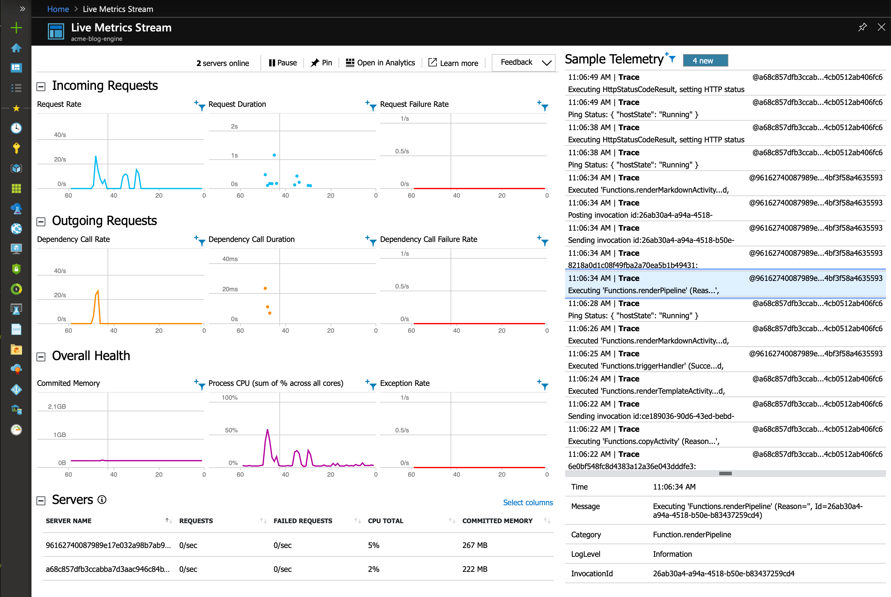

# azure-durable-functions-node-blog-engine

This is an [Azure Functions][azf] sample that demonstrates how to build a static site generator with [durable functions][azdf] to take raw markup files and render them to a [static Azure website][saw]:

All you need to do is upload your Markdown/Textile files to Azure storage, and they'll get automatically rendered to a nicely formatted web site. You can even [use OneDrive to do that automatically for you][flow].

The current demo site is [here](http://acmeblogenginebfa7.z6.web.core.windows.net) (may be temporarily broken as I build this out).

## Why

This was originally part of an "ETL" blob storage processing pipeline and intended to demonstrate how to process thousands of XML/CSV files in a scalable way and insert them into a database as they were uploaded.

But the general principle behind that kind of transformation pipeline is exactly the same as a static site generator, and handling text and image content also provides opportunity to incorporate Azure Cognitive Services and other fun things, so I turned the original pipeline into something of more general interest - i.e., a fully serverless static file generator.

> Incidentally, you can run this completely inside the [Azure Free Tier][azfree]!

## Setup

This sample currently assumes you've performed the following provisioning actions via the Azure Portal:

- Set up a NodeJS Function App (on Windows or Linux - a free tier Function App will do just fine)
- Upgraded the associated storage account to `StorageV2 (general purpose v2)`
- Enabled the `Static website` feature and made sure the `$web` container has public access enabled
- Gone into Function App `Configuration` -> `All Settings` -> `Deployment Center` and activated `Local Git` deployment via Kudu (re-visit that pane after configuration to get the Git URL and credentials)

## Contributing/Roadmap/To Do

If you feel like contributing, this is a rough roadmap/To Do list that matches what I usually need from a static file generator and some Azure-specific features that I intend to implement given time:

- [ ] Integration with Cognitive Services
- [ ] Higher-level integration with Application Insights
- [ ] Update diagram
- [ ] Add `renderTableActivity` to render YAML data into nice tables
- [ ] Azure Template for automated deployment
- [ ] List of blog posts (ordered list of everything under `/blog`)
- [ ] Add auxiliary Azure storage table for metadata lookup and building page listings using page front matter
- [ ] Handle blob deletion [using EventGrid](https://docs.microsoft.com/en-us/azure/storage/blobs/storage-blob-event-quickstart) - **Good first contribution!**
- [ ] Set generated blob metadata (modification time, caching, etc.) from page front matter
- [ ] Add screenshots on how to [integrate with OneDrive using Flow/Logic Apps][flow] - **Good first contribution!**
- [x] Flesh out example content/documentation and formatting tests
- [x] Reformat asset links (images, stylesheets, etc.)
- [x] Split blob storage access from rendering (`renderTemplateActivity`)
- [x] Templating
- [x] Image processing
- [x] Simple rendering
- [x] Sample content tree
- [x] Basic engine

## Monitoring

Since Azure Functions is usually deployed with Application Insights enabled, you can do real-time monitoring and tracing, as well as per-activity metrics:

[n]: http://nodejs.org
[azf]: https://docs.microsoft.com/en-us/azure/azure-functions/
[azdf]: https://docs.microsoft.com/en-us/azure/azure-functions/durable/durable-functions-overview
[azfree]: https://azure.microsoft.com/free/
[saw]: https://docs.microsoft.com/en-us/azure/storage/blobs/storage-blob-static-website
[flow]: https://flow.microsoft.com/en-us/galleries/public/templates/2f90b5d3-029b-4e2e-ad37-1c0fe6d187fe/when-a-file-is-uploaded-to-onedrive-copy-it-to-azure-storage-container/

