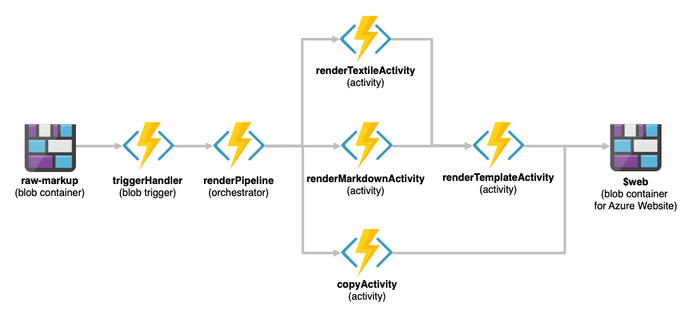

## Azure Durable Functions

This simple blog engine is written in NodeJS atop Azure Durable Functions:

The following is a short description of each function:

### `triggerHandler`

This is a simple blob trigger that is invoked whenever a file is modified in Azure storage.

### `renderPipeline`

This is the pipeline orchestrator, which figures out what needs to be done for each filetype.

### `renderMarkdownActivity`

This is the Markdown formatter, which takes the raw markup and issues a page object containing HTML.

### `renderTextileActivity`

This is the Textile formatter, which takes the raw markup and issues a page object containing HTML.

### `renderTemplateActivity`

This is the template formatter, which takes the HTML, rewrites relative URLs, and writes it to blob storage.

### `copyActivity`

This is a straightforward blob-to-blob copy activity for non-markup files (images, etc.). No transformations are currently performed.
